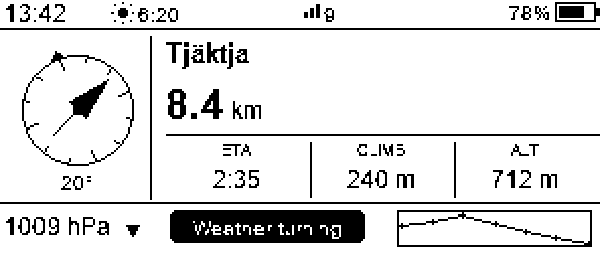
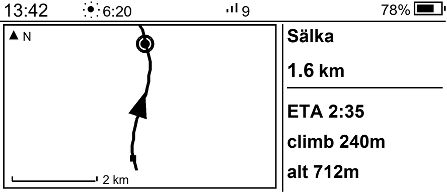

# Trail Computer

A small, battery-powered device that helps you navigate on long hikes with no
phone signal. It is built for the Kungsleden in Swedish Lapland.

It sleeps almost all the time. You press a button, it wakes up, shows where you
are and what the weather is doing on an e-paper screen, then goes back to sleep.
Everything it needs — the trail, the huts, your settings — is stored on the
device. You never need the internet on the trail.

To change settings, you hold the button. The device turns on a short-lived
Wi-Fi network. You connect with your phone and open a web page. No app to
install.

**Main parts**

- **Brain:** DFRobot FireBeetle 2 ESP32-E N16R2 (DFR1139)
- **Screen:** Waveshare 2.9" e-paper, 296×128, black/white
- **Sensors:** BME280 (air pressure, temperature, humidity), QMC5883L (compass),
  u-blox GPS
- **Buttons:** one. Press to wake, hold to open settings.

---

## What the screens look like

There are two main screens. You pick one in the settings page.

**NAV** — a compass needle to the next hut, the distance, your arrival time, the
climb left, your altitude, and the weather trend.



**MAP** — a north-up map: an arrow for you, squares for huts, a ring for your
destination, and a scale bar. The same numbers sit on the right.



These two are drawn on a PC, so the fonts are a little different from the real
e-paper. Run `python tools/preview_display.py` to redraw them yourself.

---

## How it works

The device does one thing each time it wakes, then sleeps. There is no running
loop. One wake = one cycle:

1. Read the sensors.
2. Turn on the GPS and wait for a fix.
3. Read the compass (with the GPS off, so it doesn't disturb the reading).
4. Work out your altitude by combining GPS and air pressure.
5. Find where you are on the trail. Work out the distance left and an arrival
   time (Naismith's rule).
6. Draw one screen.
7. Count the energy used, then sleep.

Anything that must survive sleep is kept in the chip's RTC memory and copied to
flash, so it also survives a battery swap. The trail itself lives in flash and
is never copied to RTC.

**Where each part of the code lives**

| File | What it does |
|---|---|
| `src/main.cpp` | runs the wake cycle |
| `src/config.h` | pins, power model, thresholds (the **VERIFY** items) |
| `src/state.{h,cpp}` | saved state, settings, trip log |
| `src/geo.{h,cpp}` | distance, bearing, snapping to the trail |
| `src/fusion.{h,cpp}` | altitude, total climb, pressure trend |
| `src/gps.{h,cpp}` | switches GPS power, waits for a good fix |
| `src/power.{h,cpp}` | energy accounting, battery curve |
| `src/sun.{h,cpp}` | sunrise, sunset, daylight left |
| `src/display.{h,cpp}` | the e-paper screens |
| `src/config_portal.{h,cpp}` | the Wi-Fi settings page |
| `src/route_table.h` | the main trail (generated from a GPX track) |
| `src/spur_table.h` | the Kebnekaise side trail (generated) |
| `src/route_stages.h` | hut distances, times, shops, sauna, transport |
| `src/route_spurs.h` | side-trail names and coordinates |
| `tools/gpx_to_route.py` | turn a GPX track into the main trail table |
| `tools/build_spur.py` | build the side-trail table |
| `tools/preview_display.py` | draw the screens on your PC as PNG images |

---

## Parts you need

| Part | Notes |
|---|---|
| DFRobot FireBeetle 2 ESP32-E N16R2 (DFR1139) | charges a LiPo over USB-C, very low sleep current. Watch out: GPIO16/D11 is not connected, GPIO5 drives the onboard LED, GPIO27 is the onboard button. |
| Waveshare 2.9" e-paper 296×128 black/white (SSD1680) | black/white only. The tri-colour version is too slow (~15 s per refresh). |
| u-blox GPS module | NEO-M9N is fast, NEO-6M is cheap. It needs a backup-power pin for quick fixes. |
| BME280 breakout | I²C, address 0x76 |
| QMC5883L compass | I²C, address 0x0D |
| P-channel MOSFET + 100 kΩ resistor | switches GPS power off during sleep |
| Momentary push button | wakes the device; wired to ground |
| 1S LiPo battery (or 18650) | charges through the board's USB-C port |
| Two resistors for battery sensing | e.g. 2× 100 kΩ, giving a ratio of 2.0 |

---

## How to wire it

The pins are set in [`src/config.h`](src/config.h). Check each one against your
own board's printed labels before you solder. The pins below are correct for the
DFR1139.

| Connect | to GPIO | Notes |
|---|---|---|
| e-paper CS | 14 | label D6. **Not** 5 — that pin drives the onboard LED. |
| e-paper DC | 25 | label D2 |
| e-paper RST | 26 | label D3 |
| e-paper BUSY | 35 | label A3. **Not** 27 — that is the onboard button. |
| e-paper SCK / MOSI | 18 / 23 | standard SPI pins |
| I²C SDA / SCL | 21 / 22 | the BME280 and compass share these |
| GPS RX / TX | 19 / 17 | board RX ← GPS TX, board TX → GPS RX. **Not** 16 — it is not connected on this board. 9600 baud. |
| GPS power switch | 13 | P-MOSFET gate, on when low |
| Wake button | 4 | wired to ground |
| Battery sensing | 34 | through the two-resistor divider |

**A note on GPS power.** The MOSFET switches the 3.3 V line and the gate is
driven straight from GPIO13. While you are first testing on a breadboard, skip
the MOSFET and run the GPS straight to 3.3 V — it's simpler. Add the switch
later to save power. If you wire it differently, change `GPS_PWR_ACTIVE_LEVEL`.

**Where to place each part.** These matter more than they look:

- Point the GPS antenna at the sky. Never put it behind the battery. Keep its
  wire away from the compass.
- The firmware only reads the compass while the GPS is off. Keep the compass
  away from battery wires and steel. Calibrate it inside the finished case.
- The BME280 reads a bit warm because the board heats it. Give it a vent and a
  thermal gap, then correct the rest with `BME_TEMP_OFFSET_C`.
- Don't bend the e-paper ribbon forward. Don't charge a LiPo below 0 °C.

---

## How to build and flash

This is a PlatformIO project (Arduino framework). If the `pio` command isn't
found, use `python -m platformio` instead.

```bash
# the real firmware
pio run -e firebeetle2_esp32e -t upload --upload-port COM3
pio device monitor -b 115200

# two test builds for bring-up (they don't change the real firmware):
pio run -e smoketest -t upload   # prints chip info, scans I²C, blinks the LED
pio run -e wifitest  -t upload   # runs just the settings page over Wi-Fi
```

The board resets into the bootloader on its own. If an upload won't start, hold
**BOOT**, tap **RST**, let go of BOOT, and try again. The board uses a CH340
USB chip — install its driver if no COM port shows up.

The device sleeps after one cycle, so the monitor prints one burst and then goes
quiet. That is normal. Press the button (or RST) to run another cycle.

---

## Tools

```bash
# Rebuild the main trail from a GPX track (Topo GPS, Gaia, Waymarked Trails):
python tools/gpx_to_route.py track.gpx --huts data/huts.csv --eps 150 --reverse --c > src/route_table.h
#   --reverse : walk north to south (index 0 = Abisko)
#   --eps     : how much to simplify the line, in metres (~150)
# Adding or removing huts changes the stop numbers, so re-pick your
# Start and End in the settings page afterwards.

# Draw the screens on your PC, no hardware needed:
python tools/preview_display.py        # writes tools/preview/*.png

# Rebuild the Kebnekaise side trail (Nikkaluokta -> Kebnekaise -> Singi).
# Shape from a GPS track plus OpenStreetMap; heights from EU-DEM:
python tools/build_spur.py > src/spur_table.h

# Run the maths tests on your PC (needs `pip install --user ziglang` once):
test\run_tests.cmd
```

Run the tests after you change `geo`, `fusion`, `sun`, or `route_util`, or after
you rebuild the trail. If a test fails, the distances, arrival times, or
daylight on the device would be wrong.

---

## How to use it

- **Press** the button: wake, show the navigation screen, sleep.
- **Hold** the button (about 2 seconds): open settings. The device starts a
  Wi-Fi network called **`TrailComputer`** (open, no password). Connect with
  your phone and open **`http://192.168.4.1`**. There you set your Start and
  End hut, your daily pace, and other options. The Wi-Fi turns itself off after
  about two minutes.

**The screens**

- **NAV** — a compass needle to the next hut, distance, arrival time, climb
  left, altitude, and the weather trend.
- **MAP** — a small north-up map: an arrow for you, squares for huts, a ring for
  your destination, and a scale bar.

Pick NAV or MAP in the settings page. You'll also see **NO FIX** (no GPS yet),
**ARRIVED / End of hike** (with trip stats), **SETTINGS**, and **LOW BATTERY**.

---

## Settings and calibration

You can change these from the settings page while hiking, with no reflash. They
are saved on the device: battery size and usable percentage, the BME
temperature correction, and your daily pace. Fixed defaults live in `config.h`.

**Calibration steps**

1. **Battery** — set `BAT_DIVIDER_RATIO` to match your two resistors, then tune
   the battery-percentage curve against your real pack.
2. **Temperature** — compare the reading to a real thermometer after the board
   warms up, then set the offset in the settings page.
3. **Compass** — calibrate it inside the finished case.
4. **Screen** — if your panel behaves oddly, switch the driver with
   `EPD_USE_T94`.

**Check before you build the final version**

- [ ] The pins match your board's printed labels
- [ ] The GPS power switch turns the right way (`GPS_PWR_ACTIVE_LEVEL`)
- [ ] The battery divider ratio is right
- [ ] The temperature offset is set
- [ ] The e-paper driver matches your panel
- [ ] GPIO4 can wake the board from sleep
