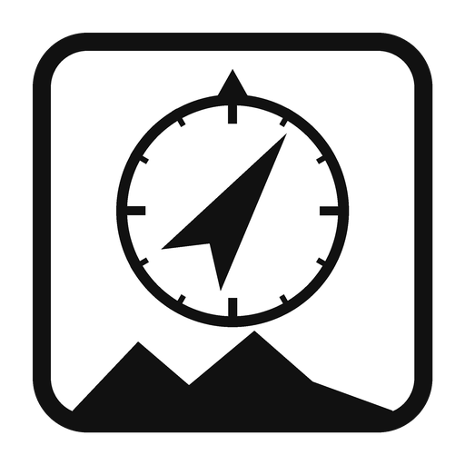

<p align="center">
  
</p>

# Kungsleden Navigator

An offline phone app for the Kungsleden in Swedish Lapland. It shows where you
are, how far to the next hut, and how your days add up — with no phone signal
and nothing to install from a store.

## Get it on your phone


1. Open **https://christofferfrisk.github.io/TrailComputer/** on your phone
   (scan the code on the right, or type in the address).
2. Add it to your home screen:
   - **iPhone (Safari):** Share → *Add to Home Screen*.
   - **Android (Chrome):** menu (⋮) → *Install app* / *Add to Home screen*.
3. Open it once while you still have signal. After that it works fully offline.

It is a normal web page, so there is no app store and no account.

<br clear="right">

## What it does

- **Finds you with GPS, even with no reception.** Your phone's GPS works without
  a mobile signal. Tap once to get a fix — the app doesn't keep the GPS running,
  to spare your battery.
- **Next hut at a glance.** Distance, climb left, and an arrival time based on
  your real walking pace, then a short list of the huts after that.
- **Whole-trip progress.** A bar and a map that fill in the part you've walked,
  including the Kebnekaise / Nikkaluokta side trail.
- **A day planner.** Pick a start and end hut and a daily pace; it splits the
  route into days using STF's stage times. Boat and bus days get a suggested
  start time — including the single daily 14:40 bus from Vakkotavare and the
  M/S Langas boat to Saltoluokta.
- **Stage notes.** Boats, scarce water, exposed passes and other things worth
  knowing *before* you leave each hut.
- **Season & safety.** Opening season, the emergency number, trail markings.

It is a planning and awareness aid, not a safety device. Carry a paper map, a
compass, and ideally a satellite messenger.

## Offline and private

Everything — the route, the huts, the stage times — is stored on your phone.
The app never sends your position anywhere. No account, no tracking, no server:
once it is cached, it runs with the network switched off.

For real terrain, use a topographic app (Fjällkartan / Lantmäteriet, Topo GPS,
OsmAnd) with the region downloaded. This app draws a schematic line only.

## How it is built

A small progressive web app (PWA) in plain HTML, CSS and JavaScript. No build
step and no framework.

| File | What it is |
|---|---|
| `docs/index.html` | the page shell |
| `docs/app.js` | position, ETA, day planner — all the logic |
| `docs/style.css` | styling |
| `docs/data.js` | route, huts and stage data (generated) |
| `docs/sw.js` | the service worker that makes it work offline |
| `docs/manifest.json` | makes it installable |
| `tools/build_pwa_data.py` | builds `data.js` from the route tables in `src/` |

Rebuild the data after changing the route or the stage notes:

```bash
python tools/build_pwa_data.py     # writes docs/data.js
```

Bump `CACHE` in `docs/sw.js` whenever you change a cached file, so installed
phones pull the update.

Run it locally:

```bash
python -m http.server 8137 --directory docs
# then open http://localhost:8137
```

## Deploy (GitHub Pages)

The app is served from the `docs/` folder by GitHub Pages. To publish it:
**Settings → Pages → Source: Deploy from a branch → `main` / `docs` → Save.**
The address above goes live about a minute later.

## The original hardware version

This started as a battery-powered e-paper handheld built on an ESP32. That
device still lives in the repo (`src/`); its build, wiring and flashing guide is
in **[docs/HARDWARE.md](docs/HARDWARE.md)**. The phone app replaced it to save
weight on the trail.

## Licence

MIT — see [LICENSE](LICENSE). Route, hut and stage data from Svenska
Turistföreningen (STF). © 2026 Christoffer Frisk.
